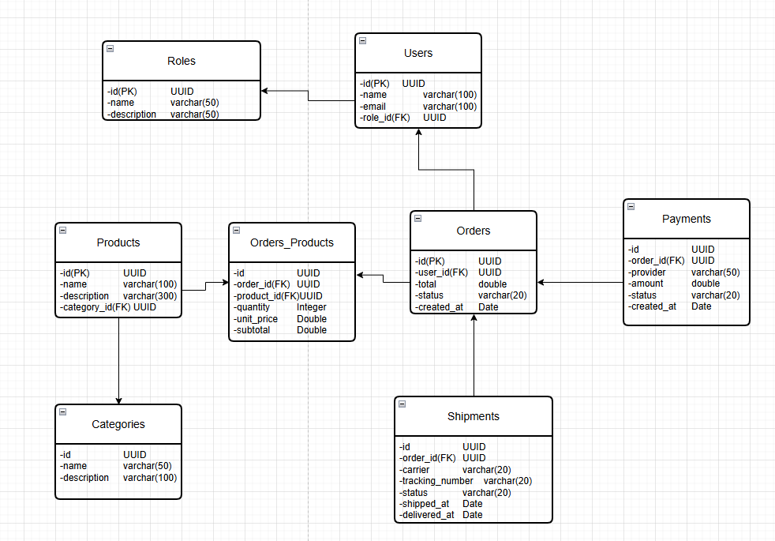

# Boutique API 

##### This project is a RESTful API built with Spring Boot for managing a boutique’s operations. It provides endpoints for handling products, categories, customers, and orders, offering a structured and scalable backend solution. The API is designed to be easy to integrate with web or mobile applications, ensuring efficient data management and a smooth shopping experience.
##### The tables for the database will be as follows

